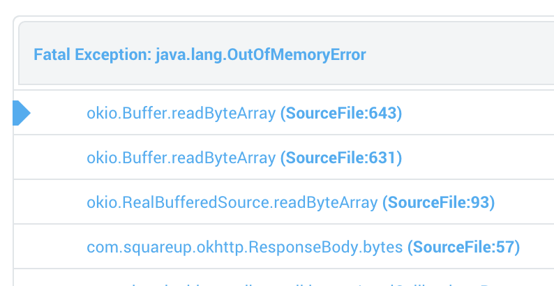

##The _Art_ of Debugging

^ this is a talk about debugging. i am not the worlds best debugger. i have worked with some really class A debuggers though.  this talk is an amalgamation of things I've learned from watching them work, and from my own experiences out in the field.

---

# What is a *Bug*??

^ lets talk about practical things first.

---

^ a bug is when your software is not working as intended.

---

## not working **as intended**

^ this can mean a bunch of things. When I worked at Etsy, we used to have a monthly bug rotation.  You'd pair up with an engineer from a different part of the organization and be tasked with fixing a bug that someone had filed, recently or not.  

^ anyone could submit a bug, most of the time they were problems with the software.

^ every once in a while you'd get one that was a larger issue, like the fact that there was nowhere to input your name, or something. [[ needs better example ]]

---

^ problems that create crash logs

---

^ problems that create unhelpful crash logs (OOMs)

---

^ software of questionable utility, problem solve-iness

---

^ sometimes visual

---

^ sometimes you send the same thing too many times.

---

^ sometimes just... buggy.

---

## 3 BUG TYPES
^ i'd like to propose that there are only 3 types of bugs.

---

## **BUG TYPE 1**
### problems you can see: __OK__

^ problems that you can see happening on your own device.

---

## **BUG TYPE 2**
### problems you cannot see: __HARD__

^ problems that you hear about happening, but you can't get it to happen for you.

---

## **BUG TYPE 3**
### problems you do not know exist: __IMPOSSIBLE__

^ but it is impossible to fix a problem that you do not know exists.

---

^ let's walk thru the steps i take when i hear about a bug.

---

^ you get an email in that looks something like this. we're not going to debug this (i have an idea of what's wrong, but i'm not sure yet)

---

## Step 1: 

---

---

^ ok this isnt the best way to deal with a bug report.

---

# How to **Deal**

^ i used to be like colbert when i'd get a bug report in.
^ then i worked with a really great developer. wed get a bug report, and id go all turtle
and hes all... excited.

---

^ he was for lack of a better word, composed, put together. fucking suave.
^ the conversation would go a little something like this: awesome, you found a bug. OR
^ sweet let's look into it.  tell me about what you were doing.
^ great, thanks for the report!
^ so now when i get bug report in, i try to be fucking elegant and suave, helpful and interrorgative.

---

^ there's two reasons for this. one, a bug is not the end of the world. it's a problem. you can solve it. it might takes some time, but you will figure out a way through it or around it. freaking out about it does not help you find a solution.

---

#TRUST

^ and two, software crashes. it's a fact of life. not everyone seems to understand this, and a large part of your perception as a developer in your organization is built on the trust that people have in the code that you write. part of that trust is that you will fix all and any problems that develop. it is your job to build trust with the people that use the software that you write. your job.

^ so the next time you hear about a bug crashing, be a person everyone trusts to solve your problem, like james bond.

---

---

## Step 1: 
### Get as Much Information as Possible

^ in this case, i've got a great amount of information: the problem is that some part of the feature i'm developing is consuming vast amounts of data

---

### Get as Much Information as Possible

> Stack Trace

---

### Get as Much Information as Possible

> Stack Trace
> Version of Android

---

### Get as Much Information as Possible

> Stack Trace
> Version of Android
> Device Make & Model

---

### Get as Much Information as Possible

> Stack Trace
> Version of Android
> Device Make & Model
> Steps to Reproduce

---

## Step 2: 
### See If You Can Reproduce It

^ you have the information. step thru the steps that they took, try it out on that phone and/or that version of android.

--- 

## Step 3:
### Google for Keywords / Search StackOverflow

---

## Step 4:
### Re-Read Your Code

---

## Step 5:
### Gather More Information

---

## Crashlytics `logException`

---

## Server Side Logging

---

## Event Graphing

---

## Google Analytics events

---

## **Debugging Interlude**

^ show thread dumps. 
^ show mac network conditioner

---

## Key Things to Remember:

---

## Key Things to Remember:

- Concurrency: Are your classes thread safe?

---

## Key Things to Remember:

- Network Conditions

---

## Key Things to Remember:

- Android has Bugs

---

## Key Things to Remember:

- But Samsung is Buggier

---

## Key Things to Remember:

- Check Your Assumptions

---

## Key Things to Remember:
- Check Your Assumptions
(aka) Your Backend Dev May Be Lying (Unintentionally)

--- 

## Preventing Bugs

---

^ even if this isn't with a unit test. run it.
^ like manually, run through all of the code.  i write out checklists for this. heres my brief checklist for networking calls:

---

## Write A Checklist

---

## Write A Checklist

- if the network is not available
- if the server has an error
- if it returns correctly
- if something else goes horribly wrong
- if the user is unauthenticated

^ here's one i go thru when i'm working on network calling code.
^ these are also bigger UI questions -> what should the user see if any of these things happen?
^ --> getting good at this stuff will make you a next level app developer.

--- 

## Beta Test

^ ask other people to try it out. (just make sure youve got that crash catcher in place)

---

## Make the Tests Automatic

^ write tests to encapsulate the tests that you do manually.
^ write tests so that you dont have to test it manually.
^ but 
^ test it manually anyways (unit tests usually miss the hard bugs, which happen at the seams of things.)

---

## Run the Automatic Tests

^ here something like jenkins or travisci can be really useful. we use a hacked up version of semaphoreCI that's not worht talking bout.

---

# What is a *Bug*??

^ lets talk about practical things first.

---

## A Bug Is A **Future You Did Not Consider**

^ its the problems youre not thinking about that are going to end up causing problems.

---

### *curated android fails*
## @volumedownpower

^ a lot of the screenshots of bugs i borrowed heavily from volume down power, a community contributed list of android fails curated by square's jesse wilson.

---

### send me your bug stories. 
## **@niftynei**

^ finally i really love bug stories. if you've got any great ones, please hit me up on twitter

---

^ some problems weve run into at Electric Objects:
^ - people unable to set up their devices (bad wifi)
^ - people mysteriously being logged out (related to bad wifi, but also a networking bug wrapped in a concurrency bug)
^ - incorrect status states being reported to the server (race condition)
