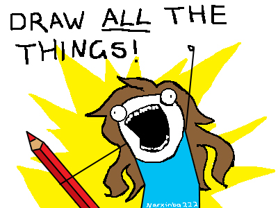
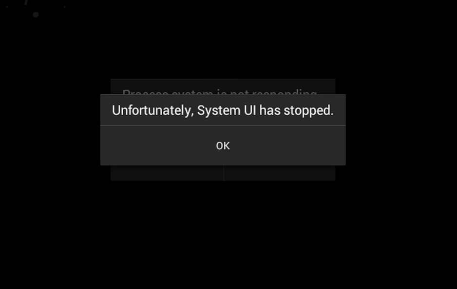

# __*getBounds()*__


# [fit] The story of Drawables and their View masters

#### __*Jamie Huson*__ + __*Lisa Neigut*__ | __10 Avril 2015__

^ Hello, bonjour.  Just to make sure everyone is in the right place, this session we will be talking about drawables.

^ I am Lisa Neigut.  I work at Electric Objects, where we're building a computer for art.  This is Jamie Huson.  Jamie works at Etsy, the online market for handmade and vintage goods that we make together.

—

#[fit]Drawables!


^ So. Drawables.  A few years ago at Devoxx 2013, an Android developer Cyril Mottier gave an excellent talk on Drawables, entitled Mastering Android Drawables.

^ In many ways, that talk was the inspiration for this one.

^ I'd like to pick up from where Cyril Mottier's talk left off and get into the specifics of the drawables APIs.

^ First I'll talk a bit about how they fit into a View’s measurement/layout/draw cycles. Then we'll go through what's changed in Drawable with Lollipop's release.

---

###  "something that can be drawn."

### __-Drawable.java JavaDocs__

/

### "a positioned entity
### that is to be drawn on a canvas."

### __-Cyril Mottier__

^ What is a drawable?  The AOSP docs define it as "something that can be drawn"

^ I like Cyril’s definition from Mastering Drawables: A drawable is a positioned entity that is to be drawn on a canvas.

----

# What Makes Drawables Awesome:
- Drawing is fun!
- Handling State Changes
- Separation of View Logic from Code
- XML
- Versatility

^ Drawables are Awesome.  Especially if you like drawing things to the screen!

^ Drawables handle state changes for user feedback, essential to a good UX

^ It's very focused Java code that separates the drawing logic from the other View logic

^ Declare them in XML, use them from XML in themes/styles (less Java)

^ Versatile - plug and play with a variety of Views

---

![60%] (drawable_hierarchy.png)

^ Drawables come in lots of shapes, sizes, and types.

---

## NinePatchDrawable

![right|80%] (nine_patch.png)

^ A drawable can be a 9 patch. A 9 patch is a PNG with stretchable regions.

^ A 1 pixel border marks the stretchable regions.

---

## ShapeDrawable

![right|25%] (shape-sample.png)

^ Shape Drawables are simple geometric shapes, usually with some shading or coloring defined.  

^ These are typically defined in XML.

---

## BitmapDrawable

![right|25%] (bitmap-sample.png)

^ BitmapDrawable is a wrapper around a native bitmap.  A BitmapDrawable is the drawing engine, so to speak, for ImageViews.  You can do some nifty things, like tiling with these.

---

## LayerDrawable

![right|25%] (layer-list-sample.png)

^ Layer Drawables are a set of drawables. Acts a lot like a FrameLayout, except for Drawables, and you can offset them in the stack.

---


## StateListDrawable

![right|25%] (state-list-drawable-sample.png)

^ State List Drawables is another drawable set.  Easy way to specify changes to a view during state changes (pressed, disabled, etc.)

---

# Custom Drawables

^ The built in drawables are quite extensive, but we can do more.

^ here's a few custom drawables I've used in projects.

---

## BadgeDrawable
![fit|right] (badge_drawable.png)

^ Jesse Hendrickson’s BadgeDrawable class is a useful one. This drawable displays a character on top of a circle drawable.

^ In this example, this is a single TextView, with a BadgeDrawable set as the right compoundDrawable. Way to keep that view hierarchy thin.

^ To update the number, we set a property on the drawable.

——

##FontDrawable
![fit|right] (icon_drawable.png)

^ Another custom Drawable that Etsy uses is a 'Font Drawable'.

^ This drawable type takes a character from a font file and turns it into a drawable.  It's a single character TextView, except more flexible and way more awesome becuase it's a drawable.

^ [[ NEXT SLIDE NOW! ]]

---

##FontDrawable
![fit|right] (icon_drawable.png)


^ Just like any text, we can use any color or size that the designs call for. Designers are big fans of them, since it cuts down on the number of assets that need clipping.

^ A lot of what we’ll talk about today comes from things I learned while creating this custom drawable type for fonts.

^ I think we can all agree that drawables are pretty sweet.

---



^ so how do we make them?

---

/res
../drawable
  .. layered_drawable.xml


^ If you were creating a drawable from scratch, you may do something like this.

^ First you create an XML file in the drawables resource folder.

---

````xml
<layer-list xmlns:android="http://schemas.android.com/apk/res/android">
    <item>
        <shape android:shape="oval">
            <solid android:color="@color/purple"/>
        </shape>
    </item>
    ...
````

^ Then you'd make yourself a drawable.

^ Here's the begining of layer list drawable.

^ The first drawable is a shape drawable. it's a purple oval.

---

layout.xml

```xml
<TextView
	...
	android:background="@drawable/layered_drawable"/>
````

^ Then we could set that drawables file as a background attribute for a view, from XML.

^ That's it.  There's one thing you may notice about this process...

---

#[fit] TOTAL JAVA CODE WRITTEN: *$0*

^ I didn't have to write any Java.

^ Let's do the same thing for a custom drawable type now.

---

## Drawable Redux, vCustom.0

---

/res
../drawable
  ..custom_drawable.xml

^ Same as before, let's make an XML file for it in the drawable resources directory.

---

````xml
<com.droidcon.drawables.custom
  xmlns:android="http://schemas.android.com/apk/res/android"
	xmlns:app="http://schemas.android.com/apk/res-auto"
	app:icon="@id/ic_etsy_e"
	app:color="@color/etsy_orange" >
</com.droidcon.drawables.custom>
````

^ I'm going to use a custom XML tag and some custom attributes for it.

^ I'm not showing the Java code for this, just yet, we'll get there in a bit.

----

layout.xml

```xml
<TextView
	...
	android:background="@drawable/custom_drawable"/>
```

^ Let's update the TextView in the layout file, to use my custom drawable.

^ Android Studio may give you some warnings, but ignore them. You can build and launch the app normally.

---



^ [[HORRIBLE SHRIEKING STATIC CRASH NOISE. LIKE A MODEM ATE A HAMSTER]]

^ At this point, I need to confess something.  

^ I lied. I didn't write the Java class for it.

—-

##Runtime Error

````
Caused by: org.xmlpull.v1.XmlPullParserException:
	Binary XML file line #2: __invalid drawable tag custom__
````

^ But it turns out that that doesn't fucking matter.

---

##Drawable.java

````java
	public static Drawable createFromXmlInner(Resources r, XmlPullParser parser, AttributeSet attrs)
	throws XmlPullParserException, IOException {
		Drawable drawable;
````

^ I traced this crash back to an SDK class, Drawable.java.

^ there's a method called createInnerXml.'  This is what gets called to inflate the drawable XML file we defined earlier.

---

```java
		final String name = parser.getName();

		if (name.equals("selector")) {
			drawable = new StateListDrawable();
		} else if (name.equals("layer-list")) {
			drawable = new LayerDrawable();
		} else if (name.equals("shape")) {
			drawable = new GradientDrawable();
		} else if ...

```

^ this method starts going through a list, looking for the XML name you provided.

---

```java
   ...
		} else {
			throw new XmlPullParserException(parser.getPositionDescription() +
			": invalid drawable tag " + name);
		}
```

^ and when it invariably can't find it, we throw a hissy fit.'

^ I mean XmlPullParseException.

---

# Seriously?

---

![75%] (android-deal-with-it.gif)

^ soooooo. defining Custom Drawables via XML isn't an option.  But there's good news.

^ Weve still got Java.

---

````java
    CustomDrawable drawable = new CustomDrawable();
    drawable.setColorFilter(Color.BLACK, PorterDuff.Mode.DST);
    mView.setBackground(drawable);

````

^ Custom Drawables are instantiated and assigned to views in Java.

^ Admittedly, not as clean as using just XML.  But drawables are totally worth it. ;D

^ Now that we know how to use them, and some limitations, let's see how you'd write them.

---

# The Drawable API

---

```java
public class NinjaDrawable extends ColorDrawable {
```

^ A custom drawable is a subclass of the abstract class Drawable

^ any time I subclass something, i try to look at what methods absolutely need to be overridden.

^ here's my short list of things you must override to get a working drawable going.

---

## Methods you definitely want to @Override

- draw(Canvas canvas)

——

`@Override`
`draw(Canvas canvas)`  (onDraw)

- Just like a View's drawing.
- Use `getBounds()` to determine drawing area

^ Fairly self explanatory. Just like a normal view. You call the draw methods on the canvas with a Paint object.
^ You can do transformations, rotations, etc on the canvas and use Shaders on Paint.
^ You should use the bounds that were set by the View. More on this later.

---

## Methods, good to know

- getOpacity()
- getIntrinsicWidth()
- getMinimumWidth()

---

`getOpacity()`

````java
    public int getOpacity() {
        switch (mState.mUseColor >>> 24) {
            case 255:
                return PixelFormat.OPAQUE;
            case 0:
                return PixelFormat.TRANSPARENT;
        }
        return PixelFormat.TRANSLUCENT;
    }
````


^ Opacity is best explained by this snippet from Color Drawable.

^ It returns the correct PixelFormat based on the colors alpha channel.

^ Used by the graphics pipeline.

---

`getIntrinsicWidth()`  (onMeasure)

````java
    public int getIntrinsicWidth() {
        return -1;
    }
````

.

````java
    public int getIntrinsicWidth() {
        return mBitmap.getWidth();
    }
````

^ The intrinsic dimensions of a drawable are the same as the height/width of a view.  You''re expected to know them when asked -- there''s no measuring pass as in a View.

^ // In the case of a solid color it has no intrinsic height. In the base of a Bitmap it might be the Bitmap's height or a scaled value.

^ the view calls this method during the measurement pass.

---

`getMinimumHeight\Width()`  (getSuggestedMinimumHeight())

^ This is the minimum height / width of your drawable class. It’s called in
`getSuggestedMinimumHeight()` in the View class.  usually 0 or whatever intrinsic returns.

---

`getMinimumHeight\Width()`  (getSuggestedMinimumHeight())


### Bottom line: implement getIntrinsic, not getMinimum.

---

## Methods, ninja level
- getConstantState() and mutate()

^ finally there's two related methods that are ninja level Drawable API stuff.

---

`getConstantState()`

![right|65%] (constant_state.png)

^ By default, every drawable inflated from the same resource shares the same state, called the ConstantState

^ When you modify the state of one instance of a drawable, all the other instances inflated from the same resources will get the same modification.

—

`mutate()`

![right|65%] (constant-state-mutate.png)

^ mutate allows you to create a new, independent constant state value for an instance of a drawable.  It orphans it from it's sibling drawables, so to speak.

^ This is useful when you want to modify properties of drawables loaded from resources

^ This is a 'one way' function.  Calling mutate() multiple times will have no further effect.

---

# Drawables + Views

^ Now that we understand the Drawable API, let's talk about how they fit in with Views.

---

# Drawable.Callback

—

```java
	 public static interface Callback {

	 	public void invalidateDrawable(Drawable who);

	 	public void scheduleDrawable(Drawable who, Runnable what, long when);

	 	public void unscheduleDrawable(Drawable who, Runnable what);

	 }
```

^ The Drawable.Callback is the interface that allows a Drawable to tell the View it needs to be redrawn. The View then invalidates itself in the area the Drawable occupies.

---

````java
	public class View implements Drawable.Callback {
```

^ The callback is implemented by the View. It''s the only interface that the View class implements.

---

```java
		public void setBackground(Drawable d) {
			mBackground = d;
			d.setCallback(this);
		}
```

^ The callback is set when a drawable is used by the View.

^ This means that drawables can only be used ONCE.

---

```java
public void invalidateDrawable(Drawable drawable) {
      ...
          final Rect dirty = drawable.getBounds();
          invalidate(dirty.left, dirty.top,
                  dirty.right, dirty.bottom);
      ...
````

^ When a Drawable needs be redrawn, the bounds of that drawable are what is invalidated.

^ Which leads into our next point of discussion: what are drawable bounds?

---

## Drawable Bounds

—--

## Drawable.java
`setBounds(Rect rect)`
`setBounds(int left, int top, int right, int bottom)`

^ bounds are defined by the View the drawable is within.  

^ the Intrinsic height and width are usually used in this calculation. but this calculation happens in the View during the measurement pass.

—

![fit] (view_coordinates.png)

^ For each View, the origin for coordinates is the top left.

---

![fit] (drawable_coordinates.png)

^ The drawable’s bounds are calculated then with reference to the View’s coordinate system.

^ These bounds are relative to placement within the VIEW.  (Not screen or window!)

---

## Binding it All Together

---

- Measurement
- Layout
- Draw

^ There are three phases to a View draw lifecycle.

——

- __*Measurement*__
- Layout
- __*Draw*__

^ Two of thse interact with the Drawable.  

^ Note that these are guidelines -- there''s no explicit contract for these.

—--

## During __*Measurement*__

- View -> `mDrawable.getIntrinsic*`
- Calculates dimens, calls children, etc.
- View Measurements -> ParentView

—-

## Sometime before __*Draw*__

- Calculates bounds for drawable
- `mDrawable.setBounds(...)`

—

## During __*Draw*__
- `mDrawable.draw(canvas)`

—--

## Caveat Emptor

^ all this to say, watch out.  there is no contract for view & drawble interactions.

^ here''s an example.

---

*ColorDrawable.java*

````java
getIntrinsicHeight() { returns -1; }
```

^ so let’s consider the what happens when a drawable passes back a height and width of -1, which means it has no set dimensions.

--- 

*CompoundButton.java*

```java
public void onDraw(Canvas canvas) {
 final int verticalGravity = getGravity() & Gravity.VERTICAL_GRAVITY_MASK;
            final int drawableHeight = buttonDrawable.getIntrinsicHeight();
            final int drawableWidth = buttonDrawable.getIntrinsicWidth();
            int top = 0;
            switch (verticalGravity) {
                case Gravity.BOTTOM:
                    top = getHeight() - drawableHeight;
                    break;
                case Gravity.CENTER_VERTICAL:
                    top = (getHeight() - drawableHeight) / 2;
                    break;
            }
            int bottom = top + drawableHeight;
            int left = isLayoutRtl() ? getWidth() - drawableWidth : 0;
            int right = isLayoutRtl() ? getWidth() : drawableWidth;
            buttonDrawable.setBounds(left, top, right, bottom);
            buttonDrawable.draw(canvas);
}
```

^ The compound button needs to handle LTR and RTL languages so during its onDraw() it passes computes the drawable's bounds correctly and then has the Drawable do its draw.

—

*ImageView.java*

```java
 if (dwidth <= 0 || dheight <= 0 || ScaleType.FIT_XY == mScaleType) {
            /* If the drawable has no intrinsic size, or we're told to
                scaletofit, then we just fill our entire view.
            */
            mDrawable.setBounds(0, 0, vwidth, vheight);
            mDrawMatrix = null;
        } else {
            // We need to do the scaling ourself, so have the drawable
            // use its native size.
            mDrawable.setBounds(0, 0, dwidth, dheight);

            ...

        } 
```

^ ImageView on the other hand uses the ScaleType to determine how bounds on the Drawable are set, and in the case of the FIT the drawable's width and height are use intrinsic values, which may be -1.
^ It's also worth noting this code is only called when the ScaleType is set not in every onDraw() like the CompoundButton.
^ Conclusion being how your Drawable interacts with a View depends entirely on the View's code. Don't make assumptions about what will be returned.

—--

# Lollipop

^ Ok, let's talk about changes to Drawables in Lollipop.

---

# Ripple

---

![75%|loop] (ripple_example.mov)


^ Material Design's Ripple was present in the L Preview which gave us a hint about things to come.
^ We noticed that the Drawable reacts to touch input.

---


![35%|loop] (ripple-masked.mov)

^ Second you'll notice the Ripple can be masked to another Drawable, such as a Bitmap.
^ The design constraints of Material Design, including Ripples, seems to be the driving force to the API changes.

---

# Lollipop - Touch Events

```
	public class Drawable {
		...

    	 public void setHotspot(float x, float y) {}

    	 public void setHotspotBounds(int, int, int, int) {}

	 	...
	}
```

^ The ability to track TouchEvents is new for Drawables.
^ The location of the TouchEvent is called the Hotspot.
^ To update the hotspot simply call the new method setHotspot() with the coordinates.
^ You can also update the bounds of the hotspot independently of the Drawable's general bounds

---

# Lollipop - Touch Events

```java

public class View {
	
	...
	
	@Override
	public void onTouchEvent(MotionEvent event) {
	 	switch(event.getAction()) {
	 		case MotionEvent.ACTION_MOVE:
	 			drawableHotspotChanged(x, y);

	 			...
	 			break;
	 	}
	}

}

```

^ In the View class the hotspot gets updated when the finger is moving in the onTouchEvent()'s Move events

---

# Lollipop - Outline

```
	public class Drawable {
		...

    	 public void getOutline(Outline outline) {}

	 	...
	}
```

^ New in Lollipop is the ability to set elevation.
^ Elevation is a key part of Material Design that allows different planes of content to be distinguishable from one another.
^ Android draws shadows for Views based on their elevation.
^ The shape of those shadows is defined by a View's Outline.
^ Since Drawables are used as the background of Views the Drawable itself provides an Outline through a new getOutline() method.
^ By default the Drawable's outline is simply its bounds but this can be modified based on the Drawable content.

---

# Lollipop - Dirty Region

```
	public class Drawable {
		...

    	 public Rect getDirtyBounds() {
    	 	return getBounds();
    	 }

	 	...
	}
```

^ The dirty region is the area that will be invalidated and redrawn.
^ Pre-Lollipop invalidation would cause the entire Bounds of a Drawable to be re-drawn.
^ This is no longer the case in Lollipop. By default the bounds are used, but this can be modified by returning a different Rect to invalidate only a region within the Drawable.

---


![35%|loop] (ripple-bounds-dialer.mov)


^ Ripples use this to define the dirty region to extend into the hosting View's parent area when its unbounded such as in Dialer.

---

# Lollipop - Theme


```
	public class Drawable {
		...

    	 public void applyTheme(Theme) { }

    	 public boolean canApplyTheme() { }

    	 public Drawable createFromXml(Resources, XmlPullParser, Theme)

    	 public Drawable createFromXmlInner(Resources, XmlPullParser, AttributeSet, Theme)

    	 public void inflate(Resources, XmlPullParser, AttributeSet, Theme)
	 	...
	}
```

^ In Lollipop the application Theme now supplies the color palette of the app through attributes.
^ This is supported in AppCompat as well.
^ Ripples are using this information to create a complementary ripples color that matches the app theme.
^ You can see here that the methods for inflation and creation  of the Drawable now includes the Theme of the app.

---


# Lollipop - Tint


```
	public class Drawable {
		...

    	 public void setTint(int)

    	 public void setTintList(ColorStateList list)

    	 public void setTintMode(Mode)

	 	...
	}
```

^ And to automatically apply the color there's a series of methods to apply the Tint color to the drawable.
^ It's important to note that it's up to the Drawable sub-class to use that color in some way.
^ The Mode in setTintMode refers to is the PorterDuff Mode which determines how the color should be applied to the drawable's content.
^ Pro-Tip: Setting a ColorFilter will override the Tint supplied either here or through the Theme

---


# Lollipop - ConstantState

```java

public class ConstantState {


	public boolean canApplyTheme()

	public Drawable newDrawable(Resources, Theme)

}

```

^ The ConstantState class also got a slight update to support theme attributes.
^ In addition the newDrawable() method now takes in a Theme to create a clone with Theme attributes intact.

---

# VectorDrawable

^ It's also worth mentioning the VectorDrawable and its sibling AnimatedVectorDrawable were added in Lollipop.
^ This allows you to load Vector graphics from SVG and display them as a Drawable.
^ The main parts of this are the SVG loader.

---

# Backwards Compatibility

**MrVector** https://github.com/telly/MrVector

^ Since the VectorDrawable's design constraints didn't require big changes to the API it's actually been backported already.
^ Recent hidden changes to the Support Library also suggest Google is working on official support for pre-Lollipop devices also.
^ Ok, what about Ripples? We hinted at efforts to do this at DroidCon NYC.

---

# Ripple

---


![center|fit] (sad-kitty.jpg)


^ Ripple's implementation heavily relies on the recent Lollipop API changes, making it not straight forward.
^ Let's talk about those challenges.

---

# Ripple

```java
	public class RippledImageView extends ImageView {

		...

		@Override
    	public boolean onTouchEvent(MotionEvent event) {
        	updateHotspot(event.getX(), event.getY());
        	return super.onTouchEvent(event);
    	}

    	private void updateHotspot(float x, float y) {

    		Drawable background = getBackground();
        	if (background != null && background instanceof RippleDrawableCompat) {
            	((RippleDrawableCompat) background).setHotspot(x, y);
	        }

    	    Drawable src = getDrawable();
        	if (src != null && src instanceof RippleDrawableCompat) {
            	((RippleDrawableCompat) src).setHotspot(x, y);
	        }

    	}

	}
```

^ Since the Ripple follows the finger, it needs to know where the TouchEvents are occuring.
^ Pre-Lollipop View's don't pass this information to Drawables.
^ In order to implement this you'll need to create a custom View subclass and pass that info yourself.
^ This means that any View using a Ripple will need to be custom.
^ This also means that integration with libraries like AppCompat become more difficult since they don't handle custom Views well.

---

# Ripple

```java
@Override
public void draw(@NonNull Canvas canvas) {
        // Clip to the dirty bounds, which will be the drawable bounds if we
        // have a mask or content and the ripple bounds if we're projecting.
        final Rect bounds = getDirtyBounds();
        final int saveCount = canvas.save(Canvas.CLIP_SAVE_FLAG);
        canvas.clipRect(bounds);

        drawContent(canvas);
        drawBackgroundAndRipples(canvas);

        canvas.restoreToCount(saveCount);
}
```

^ Implementation wise if you peek at RippleDrawable you'll see the Drawable delegates the logic of Ripples to a Ripple class.
^ The Drawable simply keeps a list of Ripples and calls through to them in draw()

---

# Ripple

```java
public boolean draw(Canvas c, Paint p) {
        final boolean canUseHardware = c.isHardwareAccelerated();
        if (mCanUseHardware != canUseHardware && mCanUseHardware) {
            // We've switched from hardware to non-hardware mode. Panic.
            cancelHardwareAnimations(true);
        }

        mCanUseHardware = canUseHardware;
        final boolean hasContent;
        if (canUseHardware && (mHardwareAnimating || mHasPendingHardwareExit)) {
            hasContent = drawHardware((HardwareCanvas) c, p);
        } else {
            hasContent = drawSoftware(c, p);
        }

        return hasContent;
}
```

^ We can see in the Ripple's draw it's choosing to draw using Hardware acceleration if available and fallback to Software.
^ Given ripples are used all over on potentially every View on screen this could quickly cause performance hits if using Software alone.
^ Ripples are constantly animating. To do this efficiently there's a hidden RenderNodeAnimator class.
^ These hidden RenderNode classes interact with the native OpenGL canvases and keep their own DisplayLists to get higher performance.

---

# Ripple

Search:

Android Graphics Pipeline Button to FrameBuffer"

AOSP:

https://source.android.com/devices/graphics/index.html


^ DisplayLists were used as part of Project Butter to speed things up by re-ordering drawing calls to be more effecient for the GPU.
^ If you want to understand more about how this works and why it acheives better performance there's a great series of blogposts. Google it
^ You can also read the Rendering and Graphics pipeline documentation on the AOSP site.

---

![center|fit] (res-drawable-folders.png)

^ It may be possible to backport this by extracting out all the classes but on older devices (especially pre Project Butter) the performance gains may not be possible to achieve for application use.
^ For most developers sticking with Selectors on pre-Lollipop devices is straight-forward and supported using resource qualifiers.

---

#[fit] Thank You!

### @JamieHuson ^.^ @niftynei

^ If you’ve got questions or want to talk more about drawables, we'll be around.
