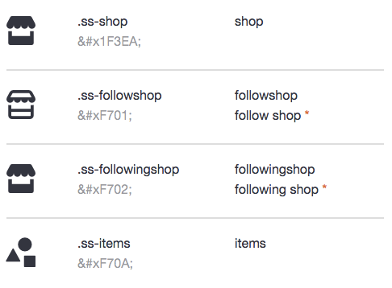

# getBounds()

# [fit] The story of Drawables and their View masters

---


[[ INSERT PIC OF LISA ]]

![right|30%] (jamie.jpg)

Jamie Huson

^ Hi, I'm Lisa I work at Etsy on the Android team. That's Jamie who works with me and he helped me put together this talk.

^ At Devoxx 2013, Cyril Mottier gave a great talk on Mastering Android Drawables. This talk aims to build on what Cyril laid out and go a bit more in-depth into the APIs / how to actually implement a custom drawable, and how they relate to a View’s measurement/layout/draw cycles.

---

# What is a Drawable?

---

### "A drawable is a positioned entity that is to be drawn on a canvas." __-Cyril Mottier__


^ Borrowing Cyril Mottier’s definition: A drawable is a positioned entity that is to be drawn on a canvas.
Here's a few examples of uses for drawables.

----

What Makes Drawables Awesome:
- Drawing is fun!
- State Changes
- Total Separation of View Logic from Code
- Focused code
- XML

^ Ok, so what makes Drawables awesome? Pushing pixels to the screen is gratifying and fun! 
^ Drawables handle state changes for user feedback, essential to a good UX
^ Its focused Java code that separates the drawing logic from the other View logic
^ XML themes/styles combined with drawables means less code
^ Ok, so what Drawables do we get from the SDK?

---

NinePatchDrawable

![right|80%] (nine_patch.png)

^ A drawable can be a 9 patch. That's a PNG that has a 1 pixel border specifying a stretchable region
^ and padding.

---

ShapeDrawable

```xml
	<shape xmlns:android="http://schemas.android.com/apk/res/android"
    	android:shape="oval">
	    <solid android:color="@color/green" />
    	<size android:height="@dimen/padding_medium" android:width="@dimen/padding_medium" />
	</shape>
```

![right|25%] (shape-sample.png)

^ It can be a shape that's specified in XML. It allows rectangle, line, oval, or a ring.

---

StateListDrawable 

![right|25%] (state-list-drawable-sample.png)

^ Drawables are flexible and useful.  You can nest different drawbles into each other.
^ It's a nice declarative approach to handling state changes.

---

BitmapDrawable

![right|25%] (bitmap-sample.png)

^ BitmapDrawable is used everywhere and has some great options like repeating a pattern on a background

---

LayerDrawable

![right|25%] (layer-list-sample.png)

^ Stack Drawables on top of each other in different ways!

---

** TODO : Show as a hierarchy tree **

^ These are some of the drawables that come with the Android SDK, which means you can create them in XML files and then assign them to views also in XML.
^ Now, we want to build custom drawables that draw even fancier things. Such as ...

---

# Custom Drawables

---

![50%] (etsy-actionbar-with-badge.png)

^ This is our cart icon that draws a custom Badge Drawable.

---

![left|115%] (icon_drawables.png)


^ Internally, we've been using them to turn fonts into icons.  Admittedly, it makes our code a bit 
more verbose at times, but it saves time in other ways, and reduces the size of our APK.

---

# Using built-in Drawables

/res
../drawable
  .. layered_drawable.xml

````xml
<layer-list xmlns:android="http://schemas.android.com/apk/res/android">
    <!-- Transparent top line for evenness -->
    <item>
        <shape android:shape="oval">
            <solid android:color="@color/transparent"/>
            <corners android:radius="@dimen/gen_avatar_corners_small"/>
            <padding
                android:top="@dimen/gen_avatar_border_shadow"/>
        </shape>
    </item>
    <!-- Light grey -->
    ...
````

^ So built-in drawables you can create like this. You save it in a drawables folder
and then you can reference it in a view, set it as a background for a view, etc, like this.

---
# Using built-in Drawables

layered_drawable.xml

````xml
<layer-list xmlns:android="http://schemas.android.com/apk/res/android">
    <!-- Transparent top line for evenness -->
    <item>
        <shape android:shape="oval">
            <solid android:color="@color/transparent"/>
            <corners android:radius="@dimen/gen_avatar_corners_small"/>
            <padding
                android:top="@dimen/gen_avatar_border_shadow"/>
        </shape>
    </item>
    <!-- Light grey -->
    ...
````

layout.xml

```xml
<View 
	...
	android:background="@drawable/layered_drawable"
/>
````

^ So what happens if I make a custom drawable?

---
## Custom Drawable

lisas_custom_drawable.xml

````xml
<custom-drawable xmlns:android="http://schemas.android.com/apk/res/android"
	xmlns:app="http://schemas.android.com/apk/res-auto"
	app:icon="@id/ic_etsy_e"
	app:color="@color/etsy_orange" >
</custom-drawable>
````

^ let's say I've got a custom drawable. It has a few properties, and I'm setting the color onto it.
This will actually compile and everything looks fine, other than the hideous red underline that 
Android Studio puts on your drawable folder.  But it will build and launch.  

----

Runtime Error

````
Caused by: org.xmlpull.v1.XmlPullParserException: Binary XML file line #2: invalid drawable tag custom
````

^ Only to crash, with a runtime error that looks something like this.
Ok, so what's going on here?

---

Drawable.java

````java
	/**
	* Create from inside an XML document. Called on a parser positioned at
	* a tag in an XML document, tries to create a Drawable from that tag.
	* Returns null if the tag is not a valid drawable.
	*/
	public static Drawable createFromXmlInner(Resources r, XmlPullParser parser, AttributeSet attrs)
	throws XmlPullParserException, IOException {
		Drawable drawable;

		final String name = parser.getName();

		if (name.equals("selector")) {
			drawable = new StateListDrawable();
		} else if (name.equals("level-list")) {
			drawable = new LevelListDrawable();
		} else if (name.equals("layer-list")) {
			drawable = new LayerDrawable();
		} else if (name.equals("transition")) {
			drawable = new TransitionDrawable();
		} else if (name.equals("color")) {
			drawable = new ColorDrawable();
		} else if (name.equals("shape")) {
			drawable = new GradientDrawable();
		}
		...
		} else {
			throw new XmlPullParserException(parser.getPositionDescription() +
			": invalid drawable tag " + name);
		}

		drawable.inflate(r, parser, attrs);
		return drawable;
	}

````

^ It turns out that the custom drawable types that are permitted are hard coded into
the Drawable class.

---

# Seriously?

---

![75%] (android-deal-with-it.gif)

---

# Good ol' Java

````java
    ShapeDrawable drawable = new ShapeDrawable(new OvalShape());
    drawable.setColorFilter(Color.BLACK, PorterDuff.Mode.DST);
    mView.setBackground(drawable);
            
````

^ So any custom drawables that we make will have to be instantiated via their Java class and assigned to the view either through a custom view layout or through set up on view construction.  
^ So it's not as easy to maintain as the XML way but we can get away with it. Plus we want the custom drawing.
^ Ok, let's dive into building custom Drawables.

---

# The Drawable API

---

Methods to Override:

- draw(Canvas canvas)

^ Of course, you need to draw on the canvas for a drawable

---

Methods to Override:

- draw(Canvas canvas)
- getOpacity()


---

Methods to Override:

- draw(Canvas canvas)
- getOpacity()
- getIntrinsicHeight/Width()

---

Methods to Override:

- draw(Canvas canvas)
- getOpacity()
- getIntrinsicHeight/Width()
- getMinimumHeight/Width()

---

Methods to Override:

- draw(Canvas canvas)
- getOpacity()
- getIntrinsicHeight/Width()
- getMinimumHeight/Width()
- setBounds(Rect bounds)

---

Methods to Override:

- draw(Canvas canvas)
- getOpacity()
- getIntrinsicHeight/Width()
- getMinimumHeight/Width()
- setBounds(Rect bounds)

---

`draw(Canvas canvas)`

- Just like a View's drawing.
- Call ```canvas.drawSomething(Paint)``` methods.
- Transformations, Rotations, Shaders all still apply.

^ Fairly self explanatory. Just like a normal view. You call the draw methods on the canvas with a Paint object.
^ You can do transformations, rotations, etc on the canvas and use Shaders on Paint.

---

`getOpacity()`


---

`getOpacity()`

ColorDrawable.java

````java
    public int getOpacity() {
        switch (mState.mUseColor >>> 24) {
            case 255:
                return PixelFormat.OPAQUE;
            case 0:
                return PixelFormat.TRANSPARENT;
        }
        return PixelFormat.TRANSLUCENT;
    }
````


^ This is best explained by this snippet from Color Drawable.
OPAQUE is anything without alpha
If it's see through, pass back transparent
if it's a combination, you're TRANSLUCENT.

---

`getIntrinsicHeight`


^ The intrinsic height/width of the drawable. 

---

`getIntrinsicHeight`

ColorDrawable

````java
    /**
     * Return the intrinsic height of the underlying drawable object. Returns
     * -1 if it has no intrinsic height, such as with a solid color.
     */
    public int getIntrinsicHeight() {
        return -1;
    }
````

^ The intrinsic height/width of the drawable is what height of the contents of the drawing in its 'basic' form.
^ In the case of a solid color it has no intrinsic height. In the base of a Bitmap it might be the Bitmap's height or a scaled value.
^ Where there is no intrinsic height you return -1, else the value.

---

`getMinimumHeight` 

^ Like intrinsic, except minimum that can be passed back is 0, instead of -1 for intrinsic.


---

`getMinimumHeight` 

--
**Return 0** instead of -1

---

`setBounds(Rect rect)`

^ TODO: Lisa talks about Bounds

---
## Reminder: Shared State

`getConstantState() and mutate()`

![right|65%] (constant-state-mutate.png)

^ It turns out that Android maintains a single drawable state for all instances of a
^ drawable to conserve memory. But sometime's we need two drawables of the same
^ type with different states. This was a popular problem early in Android and 
^ way back in 1.5 cupcake mutate() was added. It creates a new instance of a Drawable
^ with a new state, independent of the shared state Android keeps. getConstantState()
^ returns a new instance of state for a drawable.

---

# Drawables + Views

^ Ok, so let's figure out how the Drawable's work with Views.

---

## Drawable.DrawableCallback

```java
	 public static interface Callback {
	 	
	 	public void invalidateDrawable(Drawable who);
	 	
	 	public void scheduleDrawable(Drawable who, Runnable what, long when);
	 	
	 	public void unscheduleDrawable(Drawable who, Runnable what);
	 	
	 }
```

^ The Drawable.Callback is how the View and Drawable talk. Its a very simple
^ interface that allows the Drawable to tell the View it needs redrawn. The View then 
^ invalidates itself in the area the Drawable occupies. Let's focus on the invalidateDrawable method.

---

# Drawable.DrawableCallback

````java
	public class View implements Drawable.DrawableCallback {
		
		...
		
		public void setBackground(Drawable d) {
			mBackground = d;
			d.setCallback(this);
		}
		
		...
		
		public void invalidateDrawable(Drawable drawable) {
    	    ...
        	    final Rect dirty = drawable.getBounds();
            	final int scrollX = mScrollX;
	            final int scrollY = mScrollY;
    	        invalidate(dirty.left + scrollX, dirty.top + scrollY,
        	            dirty.right + scrollX, dirty.bottom + scrollY);
	        ...
    	}
    	
    	...
    
    }
````

^ Here's abbreviated code from the Android View base class. 
^ When a Drawable is set for something, like the background, the drawable's callback is assigned to be that View.
^ When the Drawable calls back that it needs to invalidate, the Drawable's Bounds are used to invalidate that region of the View on screen.

---

# Drawable.DrawableCallback

```java
	public abstract class Drawable {
		private WeakReference<Callback> mCallback = null;
		
		...
		
		public void invalidateSelf() {
    	    final Callback callback = getCallback();
	        if (callback != null) {
            	callback.invalidateDrawable(this);
        	}
    	}
    	
    	...
		
	}
```
^ Here's the Drawable side of things. When it should redraw call invalidateSelf() and the View will redraw you.
^ The single Callback is referenced. If you needed multiple callbacks triggered for one invalidateSelf() call you'll need to use a wrapper.

---

# Drawable Bounds

^ Todo: lisa

---

# The Future of Drawable 

^ Let's talk about some new drawable types coming up in L.

---

# Ripple

---

![75%|loop] (ripple_example.mov)


^ The Ripple is a fundamental part of Material Design presented at I/O. It provides feedback
^ when the user interacts with almost any UI element. There's a few different interesting parts to it.
^ First you'll notice the Ripple originates and moves with the TouchEvents going on.

---


![35%|loop] (ripple-masked.mov)

^ Second you'll notice the Ripple can be masked to another Drawable, such as a Bitmap.


---

# Ripple

```
	public class Drawable {
		...
	 	
    	public void setHotspot(float x, float y) { /* compiled code */ }
	 	
	 	...
	}	
```

^ The location of the TouchEvent is called the Hotspot. 
^ In L they added some new methods to Drawable to update the location of the Hotspot.
^ It's pretty clear that somewhere in a View class the TouchEvent locations are being passed to the Ripple.

---

# Pre-L?


^ So Drawable has been fundamentally altered in L. But let's try and bring this to our Pre-L apps. 
^ Drawing the ripples is fairly straight-forward. You're drawing two circles.
^ One covers the background and the other follows the TouchEvents. 
^ We won't dive into that because once L is open sourced we can get the animation timings and effects exact. 
^ For now let's look at the two major features which is the Hotspot and the Mask.

---

# RippleDrawableCompat

```java
	public class RippleDrawableCompat extends LayerDrawable {
	
		private float hotspotX;
		private float hotspotY;
	
		public void setHotspot(float x, float y) {
			this.hotspotX = x;
			this.hotspotY = y;
			
			// redraw
			invalidateSelf(); 
		}
	
	}
```

^ We would need to build a class that keeps track of the hotspot.

---

# RippleDrawableCompat

```java
	public class RippledImageView extends ImageView {
		
		...
		
		@Override
    	public boolean onTouchEvent(MotionEvent event) {
        	updateHotspot(event.getX(), event.getY());
        	return super.onTouchEvent(event);
    	}
    	
    	private void updateHotspot(float x, float y) {
    		
    		Drawable background = getBackground();    		 
        	if (background instanceof RippleDrawableCompat) {
            	((RippleDrawableCompat) background).setHotspot(x, y);
	        }

    	    Drawable src = getDrawable();
        	if (src instanceof RippleDrawableCompat) {
            	((RippleDrawableCompat) src).setHotspot(x, y);
	        }
	        
    	}
		
	}
```


^ Then we add a simple line to a View or Layout that passes along the TouchEvents. You can add this to any custom Views easily.
^ This simplified code doesn't take into account multiple pointers but you can easily filter by the primary pointer.

---

# RippleDrawableCompat

```java
	public class RippleDrawableCompat extends LayerDrawable {
	
		private Drawable mask;
	
		public RippleDrawableCompat(Drawable[] layers) {
			super(layers);
			this.mask = layers[0];
		}	
		
		...
	
	}
```

^ Ok cool, so let's tackle the second feature which is the mask.
^ You basically need a way to specify the mask. In L you give a Layer an ID of @android:id/mask
^ Here we just use the first layer from the LayerDrawable constructor;

---

# RippleDrawableCompat

```java
	public class RippleDrawableCompat {
	
		...
	
		@Override
    	protected void onBoundsChange(Rect bounds) {
        	super.onBoundsChange(bounds);
        
            // convert the drawable into a bitmap to use with a BitmapShader
            Bitmap maskBitmap = Bitmap.createBitmap(bounds.width(), bounds.height(), Bitmap.Config.ALPHA_8);

            Canvas maskCanvas = new Canvas(maskBitmap);
            layerOne.setBounds(bounds);
            layerOne.draw(maskCanvas);

            // this shader will limit where drawing takes place to only the mask area
            BitmapShader shader = new BitmapShader(maskBitmap, Shader.TileMode.CLAMP, Shader.TileMode.CLAMP);
            LinearGradient gradient = new LinearGradient(0, 0, 0, 0, baseColor, baseColor, Shader.TileMode.CLAMP);
            ComposeShader composed = new ComposeShader(shader, gradient, PorterDuff.Mode.SRC_IN);

			// apply the shader to the Paints
            ripplePaint.setShader(composed);
            ripplePaint.setXfermode(new PorterDuffXfermode(PorterDuff.Mode.SRC_ATOP));

            highlightPaint.setShader(composed);
            highlightPaint.setXfermode(new PorterDuffXfermode(PorterDuff.Mode.SRC_ATOP));
        }
    }
```

^ Once we know what size we are let's create our mask.
^ We're composing a BitmapShader and a LinearGradient of color of the Ripple using PorterDuff's SRC_IN mode
^ The BitmapShader is created by having the masked Drawable draw itself onto a new Canvas on a new Bitmap.
^ Once we apply the composed Shader to the Paint the Ripple will be limited the mask's shape.

---

![35%|loop] (ripple-compat-demo.mov)

^ Here's a sample video of the effects in a demo running on a Jelly Bean Emulator.

---

# Thank You!

---