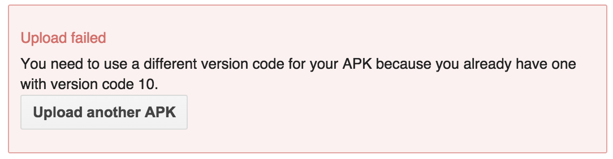
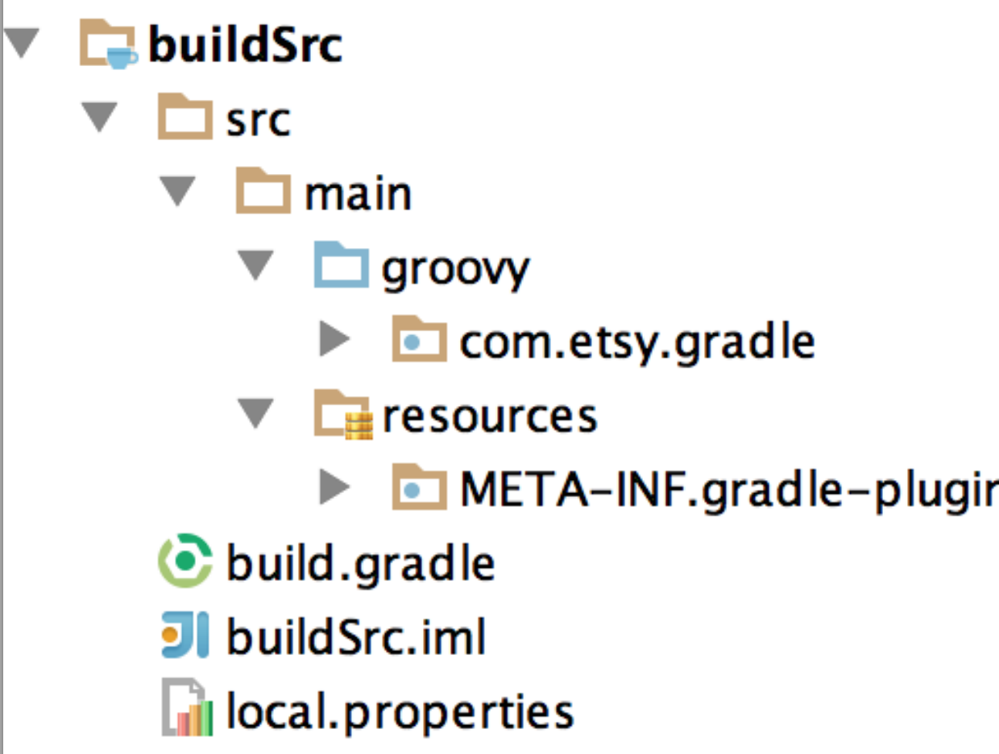

# Gradlin'

## __Pluggin' it in for Build Success__

^ Hello. Good afternoon.  This session we're talking about some strategies for organizing your Gradle build logic (and building plugins!).  
It turns out that that's a lot of ground to cover in 40 minutes.

^ Drink up that coffee. Let's learn some Gradle.

---

# Versioning
## From Project to Plugin

^ so my plan for today is to take you thru the process of building a plugin 
^ we'll start in your project's build files and walk you thru how to take build logic
^ and encapsulate it into a separate plugin

---

build.gradle

```
android {
  compileSdkVersion 23
  buildToolsVersion "23.0000000"
  
  defaultConfig {
    applicationId "neigut.lisa.gradlepractice"
    minSdkVersion 16
    targetSdkVersion 21
    versionCode 200
    versionName "200.0.1"
  } 
}
```

^ so let's take a look at a (more or less) vanilla android plugin build file

---

```
* d2b1b18 (origin/master, origin/HEAD) bump version
...
* f0f0771 bump app version number
```

^ how many of you have problems with this...

---



^ or this?
^ so being a developer, i'd like a better way to deal with updating versions.

---

build.gradle

```
android {
  compileSdkVersion 23
  buildToolsVersion "23.0000000"
  
  defaultConfig {
    applicationId "neigut.lisa.gradlepractice"
    minSdkVersion 16
    targetSdkVersion 21
    versionCode lookupVersionCode()
    versionName lookupVersionName()
  } 
}
```

^ so i'll write a method to look up the version information at runtime.

---

build.gradle

```
def lookupVersionCode() {
  return 1
}

def lookupVersionName() {
  return "1.0"
}
```

^ here's the methods that i'm calling stuff in
^ so this isn't the best. i still am going to have to go in by hand and manually 
^ update the numbers. but let's keep going.

---

build.gradle

```
project.ext.set("versionCode", 1);
project.ext.set("versionName", "1.0");
```

^ i'm going to add two project properties on my build.
^ how gradle project properties 

---

build.gradle

```
def lookupVersionCode() {
  return 1
}

def lookupVersionName() {
  return "1.0"
}
```

^ now we can replace our static versions.

---

build.gradle

```
def lookupVersionCode() {
  return project.versionCode
}

def lookupVersionName() {
  return project.versionName
}
```

^ with the project property lookup.
^ so in the sake of completeness, it's worth noting that we could stop here.

---

^ gradle has a way of passing this data in via
^ the command line.

---

```
./gradlew :project:assemble -PversionCode=10 -PversionName="10"
```

^ so you could just add them in via the command line every time you run a build.
^ i wouldn't recommend doing this because it's hard to tell what version you've just shipped
^ without checking the manifest.

---

## Writing A Task To Bump Versions

^ so let's write our first Gradle Task to that will bump the versions for us.

---

build.java

```java
project.tasks.create("bumpVersion") {
  ...
} 
```

^ there are a lot of ways to add tasks to a project, but for this example
^ we're going to use the task object on the gradle project.

^ we're going to create a task called "bumpVersion"

---

build.java

```java
project.tasks.create("bumpVersion") {
  doLast {
    ...
  }
} 
```

^ in this new task, we're going to add a code block to the doLast closure of our new "bumpVersion" task
^ this is the code that will get executed when we run the task

^ any code we put in this block won't be executed until this task is run

---

build.java

```java
project.tasks.create("bumpVersion") {
  doLast {
    project.versionCode += 1;
    project.versionName = String.valueOf(project.versionCode + ".0")
    ...
  }
} 
```

^ then we add the code to increment the version.

--- 

build.java

```java
project.tasks.create("bumpVersion") {
  doLast {
    project.versionCode += 1;
    project.versionName = String.valueOf(project.versionCode + ".0")
    project.android.applicationVariants.all { variant ->
      variant.mergedFlavor.versionCode project.versionCode
      variant.mergedFlavor.versionName project.versionName
    }
  }
} 
```

^ finally, we set the version properties dynamically on the android flavors that we're creating.
^ this makes sure that the android values get set dynamically.  otherwise, the build version numbers
^ on the android block will stay at what they were when the project was run

---

```
android {
  compileSdkVersion 23
  buildToolsVersion "23.0000000"
  
  defaultConfig {
    applicationId "neigut.lisa.gradlepractice"
    minSdkVersion 16
    targetSdkVersion 21
    versionCode lookupVersionCode()
    versionName lookupVersionName()
  } 
}
```

^ bc right now the version values are set to whatever the versions were

---

Caveats:

- `applicationVariants` is only available for `com.android.application` projects
- All product flavors will have the same `versionCode` and `versionName`

^ there are a few caveats with this: ## READ FROM SCREEN & EXPLAIN ##

---

$ ./gradlew tasks

```
Other tasks
-----------
bumpVersion
```

^ so now, when we run the gradle tasks command, our new task shows up. huzzah!
^ and if we run that task and build a new version of our app

---

$ ./gradlew bumpVersion assembleDebug

```xml
<?xml version="1.0" encoding="utf-8"?>
<manifest xmlns:android="http://schemas.android.com/apk/res/android"
    package="neigut.lisa.gradlepractice"
    android:versionCode="2"
    android:versionName="2.0">

```

^ the output manifest of that version you built will have a new version code and name!
^ huzzah!

---

build.gradle

```
project.ext.set("versionCode", 1);
project.ext.set("versionName", "1.0");

android {
  compileSdkVersion 23
  buildToolsVersion "23.0000000"
  
  defaultConfig {
    applicationId "neigut.lisa.gradlepractice"
    minSdkVersion 16
    targetSdkVersion 21
    versionCode lookupVersionCode()
    versionName lookupVersionName()
  } 
}

project.tasks.create("bumpVersion") {
  doLast {
    project.versionCode += 1;
    project.versionName = String.valueOf(project.versionCode + ".0")
    project.android.applicationVariants.all { variant ->
      variant.mergedFlavor.versionCode project.versionCode
      variant.mergedFlavor.versionName project.versionName
    }
  }
} 
```

^ here's what all that code looks like, together in our build.gradle file

---

build.gradle **old**

```java
  defaultConfig {
    versionCode lookupVersionCode()
    versionName lookupVersionName()
    ...
  }
```

build.gradle **new**

```java
  defaultConfig {
    versionCode project.versionCode
    versionName project.versionName
    ...
  }
```

^ there's one thing to note: we don't need the lookupVersion() methods anymore

---

## Saving the State

^ we have another problem with this task.
^ presumably we're going to want to ship code that is more than just version 2

^ first we need a place to store that state.

---

```
AndroidApp
- build.gradle
- app/
-- src/
-- build.gradle
```

^ this is the typical project structure of an Android project.
^ let's add another file to hold our state in

---

```
AndroidApp
- build.gradle
- app/
-- src/
-- build.gradle
-- version.gradle
```

^ this is just a file name that i made up. i could have called it anything else.

---

versions.gradle

```
majorVersion=2
minorVersion=0
bugFixVersion=0
```

^ this is what's inside that versions.gradle file.  
^ you can see that we're currently on version 2.0.0

---

versions.gradle

```
majorVersion=2
minorVersion=1
bugFixVersion=0
```

^ and here's what the versions file would look like for version 2.1.0

---

just released version: 2.0.0

version currently in testing: 2.1.0

^ here's what those version numbers look like spelled out

---

## Load the State

^ great our state has a place to be saved.
^ now we need a way to load the state from this file into the gradle project.

---

build.gradle

```
def String VERSION_FILE_NAME = "versions.gradle"
```

^ constant for our filename

---

build.gradle

```
def String VERSION_FILE_NAME = "versions.gradle"

project.ext.set("majorVersion", 0);
project.ext.set("minorVersion", 0);
project.ext.set("bugFixVersion", 0);
```

^ then we 'prepopulate' or go ahead and define the project properties for each of these values

---

build.gradle

```
loadVersion() {
  def versionFile = new File(project.projectDir, VERSION_FILE_NAME)
  versionFile.eachLine() { line ->
    def (key, value) = line.split("=").collect { it.trim() }
    if ("majorVersion".equals(key)) {
      project.majorVersion = Integer.parseInt(value)
    }
    ...
  }
}
```

^ here's our method for loading the versions into the project properties
^ you'd add an if statement for each of the different version numbers.

---

## Increment and Save To Disk

^ ok, we can read the file in.
^ let's write some methods for writing an incremented number back out to disk
^ so we can fully save the state for our next run.

---

//TODO:
- Create 3 tasks (one for each version 'type')
- Each task increments the appropriate project property
- Write out the new values to `verisons.gradle`

^ we have 3 things that we need to do for this objective to be achieved.

---

build.gradle

```java
def VERSIONS = ["majorVersion", "minorVersion", "bugFixVersion"]
...
   VERSIONS.each { versionType ->
      projects.tasks.create(name: "bump$versionType") {
        doLast {
          project.ext[versionType] += 1
          ...
        }
      }
```

^ here, we're creating 3 tasks dynamically, one for each of the version types that we have

---

build.gradle

```java
def VERSIONS = ["majorVersion", "minorVersion", "bugFixVersion"]
...
   VERSIONS.each { versionType ->
      projects.tasks.create(name: "bump$versionType") {
        doLast {
          project.ext[versionType] += 1
          // write to versions.gradle file
          // update the applicationVariants values
        }
      }
```

^ there's two more things we need to add to this task: (read from slide)

---

build.gradle

```java
def VERSIONS = ["majorVersion", "minorVersion", "bugFixVersion"]
...
   VERSIONS.each { versionType ->
      projects.tasks.create(name: "bump$versionType") {
        doLast {
          project.ext[versionType] += 1
          new File(project.projectDir, VERSIONS_FILE_NAME).withWriter { out ->
            out.write {
               """majorVersion=${project.majorVersion}
               minorVersion=${project.minorVersion}
               bugFixVersion=${project.bugFixVersion}
               """
            }
          }
          // update the applicationVariants values
        }
      }
```

^ this code writes out our new Version.gradle file
^ and then we've already seen the updating code above, so i'm not replicating it here.

---

build.gradle

```
bumpmajorVersion
bumpminorVersion
bumpbugFixVersion
```

^ now when we run gradle tasks, we can see all of the tasks we've just created.
^ and if we run one of these tasks.

---

$ ./gradlew bump__major__Version

versions.gradle

```java
majorVersion=3
minorVersion=0
bugFixVersion=0
```

^ we can see the values get updated in our versions file. yes.

---

$ ./gradlew bump__bugFix__Version

versions.gradle

```java
majorVersion=3
minorVersion=0
bugFixVersion=1
```

^ running a different task increments a different version number. coool

---

AndroidManifest.xml

```xml
android:versionName="3.0.1"
```

^ here's what it will look like when we build the project

---

build.gradle

```java
def VERSIONS = ["majorVersion", "minorVersion", "bugFixVersion"]
afterEvaluate {
   VERSIONS.each { versionType ->
      projects.tasks.create(name: "bump$versionType") {
        doLast {
          project.ext[versionType] += 1
          new File(project.projectDir, VERSIONS_FILE_NAME).withWriter { out ->
            out.write {
               """majorVersion=${project.majorVersion}
               minorVersion=${project.minorVersion}
               bugFixVersion=${project.bugFixVersion}
               """
            }
          }
          // update the applicationVariants values
        }
      }
```


^ there's one line that i left out. 

---

build.gradle

```java
afterEvaluate {
  ...
}
```

^ this is the afterEvaluate hook

---

```java
beforeEvaluate { project -> ... }

afterEvaluate { project -> ... }
```

^ there are two hooks, one for before and after the evaluate stage of a gradle build

---

```java
beforeEvaluate { project -> 
  // set up project properties
  // load the versions from disk
}

afterEvaluate { project -> 
  // create tasks to bump versions
}
```

^ if we put the logic for our versions code into these hooks
^ this would be how i would divide it out.

---

^ cool. so that about wraps up our putting together some versioning code.
^ let's take a quick look at what we've achieved so far

---

Versioning
1. Stateful versions
2. Gradle tasks to change the version number
3. Build server (Jenkins) can easily manage version numbers
4. Can be checked into source control (Git)

^ READ and EXPLAIN

---

^ but then your project manager has a great idea. and they come to you and say...

---

## Let's Make A New App

^ let's consider our options of how to reuse this code.

---

Options

- Ctrl-C, Ctrl-V

^ our first option!
^ i leave this as an exercise for the audience. ;)

---

Options

- Ctrl-C, Ctrl-V
- Share logic via the root project

^ we didn't really talk about the magical root project, but there's a way to write
^ global gradle code for a multi-project build.
^ this only works for multi-project builds.

---

Options

- Ctrl-C, Ctrl-V
- Share logic via the root project
- Use a Gradle Plugin

^ option 3 is write a reusable and shareable gradle plugin.

---

Options

- Ctrl-C, Ctrl-V
- __Share logic via the root project__
- Use a Gradle Plugin

^ let's explore option 2.

---

## Multi-Project Builds

---

```
AndroidApp
- build.gradle
- app/
-- src/
-- build.gradle
```

^ remember our typical build structure for a project.
^ this is a single project structure.
^ adding a second project would make our project directory look like this:

---

```
AndroidApp
- build.gradle
- app/
-- src/
-- build.gradle
- app2/
-- src/
-- build.gradle
```

---

```
AndroidApp
- build.gradle  (root)
- app/
-- src/
-- build.gradle (app1)
- app2/
-- src/
-- build.gradle (app2)
```

^ here's how these build files belong to. 
^ if we move our build logic from the app1 file and into the root file.
^ we can share it with any other projects in this multi-project build.

---

Versioning Steps

- Add `bumpVersion` tasks
- Set up project properties
- Load the versions file
- Set the variant version

^ before we get into it, lets talk about a few hooks that are available at the root project level

---

Root Project Hooks

- allprojects {}
- subprojects {}
- project(':app') {}

^ EXPLAIN WHAT THESE ARE. (all includes root)

---

app/build.gradle

```java
afterEvaluate { ...  }
```

^ remember how originally we had an afterEvaluate block in the project build.gradle file

---

app/build.gradle

```java
afterEvaluate { ... }
```

build.gradle  (root)

```java
subprojects { 
  project.afterEvaluate { ... } 
}
```

^ this is how you'd add an afterEvaluate block for every subproject off of the root project

---

Versioning Steps

- **Add `bumpVersion` tasks**
- Set up project properties
- Load the versions file
- Set the variant version

^ let's dynamically generate our bumpVersion tasks now

---

build.gradle   (root)

```java
def VERSIONS = ['majorVersion', 'minorVersion', 'bugFixVersion']
subprojects {
  project.afterEvaluate {
    // create bump version tasks here, dynamically
  }
}
```
---

Versioning Steps

- Add `bumpVersion` tasks
- **Set up project properties**
- Load the versions file
- Set the variant version

---

build.gradle   (root)

```java
def VERSIONS = ['majorVersion', 'minorVersion', 'bugFixVersion']
subprojects {
  project.afterEvaluate {
    // create bump version tasks here, dynamically
  }
  project.beforeEvaluate {
    VERSIONS.each { version -> 
      project.ext.set(version, 0)
    }
  }
}
```

^ here, i'm adding a property for each version, initialized as 0

---

Versioning Steps

- Add `bumpVersion` tasks
- Set up project properties
- **Load the versions file**
- Set the variant version

---

build.gradle   (root)

```java
def VERSIONS = ['majorVersion', 'minorVersion', 'bugFixVersion']
subprojects {
  project.afterEvaluate {
    // create bump version tasks here, dynamically
  }
  project.beforeEvaluate {
    VERSIONS.each { version -> 
      project.ext.set(version, 0)
    }
    loadVersions(project)
  }
}
```

^ after setting the version, we load the versions into the properties

---

Versioning Steps

- Add `bumpVersion` tasks
- Set up project properties
- Load the versions file
- **Set the variant version**

---

app/build.gradle   (app1/app2)

```java
  defaultConfig {
    versionCode project.majorVersion * 10 + project.minorVersion // etc
    versionName project.majorVersion + " " + project.minorVersion // etc
    // ...
  }
```

^ explain slide (using project property to set android plugin property)

---

```
$ ./gradlew :app:bumpminorVersion :app2:bumpmajorVersion
```

^ now you can call the version on each of the apps individually

---

```
$ ./gradlew :app:bumpminorVersion :app2:bumpmajorVersion

$ ./gradlew bumpminorVersion
```

^ or on every subproject with a single command

---

Options

- Ctrl-C, Ctrl-V
- Share logic via the root project
- __Use a Gradle Plugin__

^ so that about wraps up option 2.
^ lets explore now how we can take this code and pull it up into a gradle plugin
^ remember, plugin code can be used across apps, in diverse projects

---

## Gradle Plugins

---

### Where can Plugin code live?

---

# Where can Plugin code live?
- in the project class itself
- in `buildSrc`
- as a separate jar

---

```
AndroidApp
- build.gradle   (root)
- app/
- app2/
```

^ this is a normal 2 project multiproject gradle build
^ you can add the buildSrc files to this structure
^ ## explain a bit about how this makes it easier to debug / run while building.

---

```
AndroidApp
- buildSrc/
- build.gradle   (root)
- app/
- app2/
```

^ you can just manually add a new directory to your project structure

---

- groovy package
- resources directory with a META-INF folder
- build.gradle file



^ there are three things you need inside of your `buildSrc` folder
^ ## READ ALOUD ##
^ let's dig into the groovy code we'll need inside that groovy package

---

- an extension class
- the plugin class

^ there are two components to the Groovy code of a plugin.
^ an extension class, that acts like a mega properties object on a project
^ and a plugin class that applies the extension to the project

---


```java
// Project Property
project.ext.set("majorVersion", 0)

// Project Extension
project.extensions.create("appVersion", VersionExtension)
project.appVersion.majorVersion = 0
```

^ let's start with extensions.
^ ## EXPLAIN CODE

---

VersionExtension.groovy

```java
class VersionExtension {
  def int majorVersion
  def int minorVersion
  def int bugFixVersion
  // ...
}
```

^ i can add some properties to this extension...

---

VersionExtension.groovy

```java
class VersionExtension {
  // ...
  def releaseString() { majorVersion + DOT + minorVersion + DOT + bugFixVersion }
  def code() { majorVersion * 10**6 + minorVersion * 10**4 + bugFixVersion }

  // 1.4.1
  // 1040001
}
```

^ ... and some handy methods

^ ok, we've basically got our extension more or less constructed. we're missing a few methods, but i think you get the idea

---

VersionsPlugin.groovy

```java
class VersionPlugin implements Plugin<Project> {
```

^ the plugin class that implements plugin.
^ there is only one method that you need to implement for the Plugin inteface

---

VersionsPlugin.groovy

```java
class VersionPlugin implements Plugin<Project> {
  void apply(Project project) {
    \\ plugin set up logic
  }
}
```

---

build.gradle  (root)

```java
subprojects {
  project.afterEvaluate { ... }
}
```

^ remember how we used to have an after evaluate block in the root project file?

---

build.gradle  (root)

```java
subprojects {
  project.afterEvaluate { ... }
}
```

VersionsPlugin.groovy

```java
void apply(Project project) {
  project.afterEvaluate { ... }
}
```

^ now it's applied in the apply method of the plugin

---

VersionsPlugin.groovy

```java
class VersionPlugin implements Plugin<Project> {
  void apply(Project project) {
    project.extensions.create("appVersion", VersionExtension)
    project.appVersion.loadVersions(project)
    project.afterEvaluate {
      VERSIONS.each { version -> 
        project.tasks.create(name: "bump$version") {
          doLast {
            project.appVersion.bump(version)
            // Write out to file
            // Update `android` plugin values
          } 
        }
      }
    } 
  }
}
```

^ ## EXPLAIN THIS

---

## Use your Plugin

^ ok, we've gotten it built. how do we use it in our project build.gradle files?

---

- Expose
- Apply
- Use

^ last three steps to using a plugin.

---

Expose


---

Expose

buildSrc/resources/META-INF.gradle-plugins/appVersion.properties

```java
implementation-class=neigut.lisa.gradle.VersionsPlugin
```

---


Apply

app/build.gradle

```
apply plugin: 'com.android.application'
apply plugin: 'appVersion'
```

---

Use

app/build.gradle

```
android {
  defaultConfig {
    versionCode appVersion.code()
    versionName appVersion.releaseString()
  }
}
```

---

# Lisa Neigut
##[fit] work @electricobjects
##[fit] me on the internet, @niftynei


---

## ~thank you~

