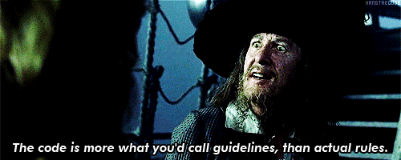
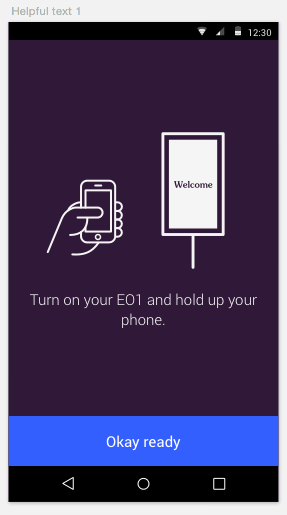

# Android Development 
## A Pirate's __CODE__ 

^ - hello!
^ - today: talk about a code for app dev

---


^ it's not that kind of code
^ and if you've seen the movie... you already know that

---



^ you know they're more like guidelines anyway
^ so! [ with GUSTO ]
^ this talk was (appropriately) named:

---

# Android Development 
## A Pirate's __Guidelines__

---

# Where did these come from?

^ so i started at Electric Objects in January
^ i started where, i'm sure most of us end up every once in a while:
^ coming in to take over a project from some consultants
^ which is to say more or less starting over from scratch
^ (sorry StartUp Giraffe)
^ when i got there, i found that myself asking this question:

---

# Where did these come from?
## How Do I Start An Android App?

^ um.  
^ # awkward pause #
^ good question.
^ to be honest, i kind of had no idea.

--- 


^ if you're a lucky android dev, you probably start off with something that looks like this.
^ mock ups that your designer made.
^ if you're not lucky, you'll definitely start out with something that looks like this

---


^ mock ups for an iOS app.

---

^ Ok, I've got some designs, so clearly we're not at square one.
^ so let's refine the question a little bit.

---

# How do I map these mock ups to Android 'Pieces'?

---

^ my only other experience with this has been at Etsy
^ when i started at Etsy, there were only two of us on the Android team
^ myself, who had never worked as a software developer before
^ much less written an entire android app.
^ and our Senior Android Dev Tim, 
^ who was actually an iOS dev who decided Android was the next big thing
^ and that Etsy needed to get with it.


---

^ now tim was probably one of the smartest app dev's i've ever known
^ he'd done a bunch of reading on Android apps and was really into
^ this new app dev paradigm called 'Fragments'
^ the original Etsy Android app looked something like this


---

^ it seemed to work ok, but at some point i think we started running into some problems
^ the app grew in size, we did a big redeisgn, one that added tablet layouts
^ by the time I left Etsy, when you were adding a new feature to the app
^ this is more or less what our app looked like 


^ hmmmm. # pause #
^ when i got to EO, i decided to improve upon this architecture just a bit
^ nothing too crazy or revolutionary

---


^ and in the process created my first "Pirate Guideline"

---

# Pirate Guideline #1


---

# Pirate Guideline #1
## There is a one to one correspondence between a wireframe screen and an Activity

^ what's nice about this?

---

# Super easy to get started writing a new application

---


^ so now this beautiful mock up that luke made

---


^ begins to look a whole lot more like a blueprint. winning
^ great! let's get started.

---

^ so as you do, i start looking for similarities between these mock ups
^ hmm, these look very similar




---

^ so you start building something that looks like this

```java
OkayActivity.java
setContentView(R.layout.activity_generic.xml);
```

```java
SuccessActivity.java
setContentView(R.layout.activity_generic.xml);
```
^ so far so good. 
^ the success message is just an image anyways, screw i18n
^ both of them have buttons. 
^ less code to maintain, whoo hoo. looking good.

--- 

^ then your designer is looking at your app a few days later
^ and you have a conversation that goes a little something like this

---

` luke: hey lisa! 👋`

---

`luke: hey lisa! 👋`
`lisa: hey! 👋🏽`

---

`luke: the app's looking really great! 👍🏻`

---

`luke: the app's looking really great! 👍🏻`
`lisa: /me blushes ☺️`

---

`luke: just one thing`

^ # pause to let people read it #
^ # say # stomach starts to drop a bit

---

`luke: just one thing`
`luke: *explains how someone could get stuck*`

---

`luke: we need a logout button`

---


---

`lisa: /me prepares diatribe on the Android Back Button`

---

`lisa: /me realizes she is vastly outnumbered by iOS devices`

---

`lisa: /me thinks furiously`

---

^ HMMMMMMMM.
^ # look left.  look right. (furtively) #

---

`lisa: /me ctrl-C; ctrl-V`

---

```java
OkayActivity.java
setContentView(R.layout.activity_generic.xml);
```

```java
SuccessActivity.java
setContentView(R.layout.activity_slightly_less_generic.xml);
```

^ and that's how i came up with my second guideline

---

# Pirate Guideline #2


---

# Pirate Guideline #2
## Every Activity has its own layout file

^ which, in practice, looks like this:

---

^ i'm sure some of you are thinking, lisa you're daft.
^ which is totally true.
^ what about this other, more general programming best practices principle

---

# PRGRAMMING BEST PRACTICES PRINCIPAL 101

---

# PRGRAMMING BEST PRACTICES PRINCIPAL 101
## DRY: Don't Repeat Yourself

^ one i'd say that's hogwash.
^ two, i'd say that's it's more like a guideline than a hard and fast rule.
^ and that if you've got view code that you're repeating
^ that's where my next guideline comes in

---

^ now, there's one exception to this rule in the Electric Objects app
^ that I wish i had followed my own advice on.

---


^ but as i was coding it, i started to see a bunch of differences
^ that's the LoginActivity.java

---


^ for the login activity, i condensed two views, and put a lot of the logic into a single class
^ a single LoginView

---


^ but as i was coding it, i started to see a bunch of differences

---


---


---


^ these screens ended up having a lot of differences which would have been far easier to deal
^ with as layout code rather than logic statements.
^ there was one redeeming quality to this screen, and that was my next guideline
^ the majority of the branching logic for views on this screen is wrapped up in a single view class

---

^ which, as it happens, is guideline number 3

---

# Pirate Guideline #3

---

# Pirate Guideline #3
## Reusable View code belongs in a View class

^ if you've got view code that you want to use again, put it in a view class.

---


^ here's an example of a view class that is in practically every every
^ activity layout of our app

^ there's a corollary to this rule.  sometimes you can get away without writing a view class
^ for repeated view code

---

# PRGRAMMING BEST PRACTICES PRINCIPAL 101

^ which, as it happens, fits another programming best principles practice thing

---

# PRGRAMMING BEST PRACTICES PRINCIPAL 101
## Favor composition over inheritance

^ talk some about using the error view.

---


^ for example, here's a view that gets repeated a few times.

---


^ that i wanted to resize nicely for different views.

---


^ sweet. now i've got less code to worry with and it'll be easy to change a style if this every changes.
^ so i'd say there's a corollary to guideline 3...

---


^ I ended up using different styles for the landscape and portrait layouts
^ but that defined as the same style, that i can then apply to each of these
^ generic ImageViews

---

# Pirate Guideline #3A
## Reusable View attributes belong in a style

^ you can get away with some pretty cool, flexible view code with some creative styling.

---

^ you may have noticed that i haven't mentioned fragments yet.
^ that's because i don't really need them.
^ i try to make it a point not to need them.
^ which is Pirate Guideline number 4

---

# Pirate Guideline #4

---

# Pirate Guideline #4
## Fragments are not simple.  Don't use fragments.*

---

# Pirate Guideline #4
## Fragments are not simple.  Don't use fragments.*

#### *unless it is absolutely necessary

^ so it's been a while since i've used a fragment for view code.
^ and i was having trouble remembering why this was such good advice.
^ then i was talking to a friend of mine, kasra who works at stack exchange.
^ i'd like to share with you part of our conversation

---


---


---

^ 

^ ---

^ raise your hand if you've ever had a conversation
^ or run into a similar bug with fragments before?

^ # pause to let people raise their hands #
^ now look around you.  let's pause for moment, a sad moment,
^ to just feel sad about fragments.

---

#💧🌹🌹🌹🌹

^ # moment of sadness for how sad fragments are #

^ that's all i'm going to say about using fragments for view code.

---

^ the next guideline
^ actually the next several guidelines
^ really come from a debates we used to have at Etsy
^ about the best way to handle rotation in an app

---

```java
  @Override
  public void onConfigurationChanged(Configuration newConfig) {
      super.onConfigurationChanged(newConfig);
  }
```

^ during my time at etsy, 
^ it was not uncommon to see something like this in your activty code

---

```java
  @Override
  public void onConfigurationChanged(Configuration newConfig) {
      super.onConfigurationChanged(newConfig);
      \\ ~~something real hacky~~
  }
```

^ when we did this we ended up with a lot of weird bugs.

---

- languages not changing correctly

---

- languages not changing correctly
- views not resizing properly

---

- languages not changing correctly
- views not resizing properly
- strange invocations to .onSaveInstanceState() in `onConfigurationChanged`

^ i sum these problems up this way:

---

- BUGGY
- HARD TO TEST
- HARD TO FIX

---

# Pirate Guideline #5

---

# Pirate Guideline #5

## Never override configuration changed.*

^ i don't think most people do this, but i don't think it's a bad guideline to have either way.

---

# Pirate Guideline #5

## Never override configuration changed.*
#### * for view code

^ that being said, i'm sure that there's some rational reason for overriding
^ on config changed for non view or state related things. this guideline doesn't
^ apply to that.

---

```java
setRetainState(true);
```

^ [intro]
^ (if you're not using fragments, this won't apply to you)
^ but if you are...
^ this suddenly becomes a bigger question

---

```java
setRetainState(true);
```
How well do you *really* know the Activity Lifecycle?

^ disclaimer, it's been a while since i've used fragment
^ so i'm a bit rusty as to why this is such a horrid idea.
^ and honestly i do use it a decent amount with headless fragments

---

^ there is one thing that you should retain!
^ and that is the state of the activity as it was
^ when it was interrupted.
^ there's a real nice method you can use for that

---

```java
    @Override
    protected void onSaveInstanceState(Bundle outState) {
      super.onSaveInstanceState(outState);
      // save my state!
    }
```

^ really, anything that you're saving, should be saved here.
^ you can get real fancy about how you do this (see next)
^ but do it here. here. here.

---

# Pirate Guideline #6

## Retain nothing but state*

^ basically if you're following guideline FOUR and not using fragments for view code
^ this guideline probably doesn't much apply to you.
^ tho everyone should be saving their state

---

# Pirate Guideline #6

## Retain nothing but state*

#### *and hardware adapters

^ there are instances though where there are bigger objects that you need to retain
^ across an activity re-creation
^ which leads to one caveat with this rule.

---

# CAVEAT: 

---

# CAVEAT: 
## headless fragments

^ a headless fragment is one that is retained 
^ across activity saveinstance states.
^ super invaluable for hardware adapters

---


^ [ pause a beat ]
^ so the last guideline
^ is really a reflection of all the hardware adapters that i've had to deal with.
^ and the shift in mentality that i had to make from doing web development

--- 


^ when you're developing for the web
^ depending on what you're doing of course, 
^ you don't really have to worry too terribly much about maintaining state

^ on android, state is the thing that bites you in the ass every time you sit down.

---


^ or turn over.

---

# Pirate Guideline #7


---

# Pirate Guideline #7

## Embrace state machines

^ # read guideline out loud #
^ so you may be thinking to yourself, what is a state machine

---

# A State Machine
- States are explicitly defined
- Can only do certain things in each state
- Where you can go next depends on where you are now

^ basically, a state machine is an object
^ where the functions available to be preformed are relative to what state
^ the object finds itself in, and where the states
^ are generally ordered, such that the next state you can move to is determined by
^ the current state you find yourself in.

---


^ or in other words...

---

^ these come in handy, especially when dealing with large objects that have to be retained
^ across activity re-creates
^ like hardware adapters

---


---


---

# Android Development 
## A Pirate's __Guidelines__ 

---

- There is a one to one correspondence between a wireframe screen and an Activity
- Every Activity has its own layout file
- Reusable View code belongs in a View class
- Fragments are not simple.  Don't use fragments.*
- Never override configuration changed*
- Retain nothing but state*
- Embrace state machines

---

# Lisa Neigut
##[fit] work @electricobjects
##[fit] me on the internet, @niftynei


---

## ~thank you~

